# MOPI-HFRS: Multi-Objective RL Reranker — System Design & Technical Reference

> **Branch:** `aarya/actor-critic-no-pool`  
> **Dataset:** 8,170 users · 6,769 items · 314K interactions (60/20/20 train/val/test)  
> **Embeddings:** Frozen LightGCN embeddings (128-dim) loaded from `embeddings_checkpoint.pt`

---

## Table of Contents

1. [The Evaluation Bug Fix — Why Our Baseline Went From 0.102 → 0.222](#1-the-evaluation-bug-fix)
2. [Purpose of Imitation Pretraining](#2-imitation-pretraining)
3. [Actor-Critic (A2C) vs. REINFORCE](#3-actor-critic-a2c-vs-reinforce)
4. [Goal of the RL Loop — What It Adds Over the GNN Baseline](#4-goal-of-the-rl-loop)
5. [Candidate Pool Removal — Full Item Space](#5-candidate-pool-removal)
6. [Reward Formulation](#6-reward-formulation)
7. [Training Process — Step by Step](#7-training-process)
8. [Performance Optimizations](#8-performance-optimizations)
9. [System Design Diagram](#9-system-design-diagram)

---

## 1. The Evaluation Bug Fix

### Background

The original `main.py` `eval()` function contained three independent bugs that together produced an artificially low GNN NDCG of **~0.102**. All MORL results must be compared against the **corrected baseline of ~0.222**.

### Bug 1 — Edge-Indexed User Embedding Matrix

**Original (buggy) code:**
```python
users_emb_final = users_emb_final[test_ei[0]]   # <-- WRONG
```

`test_ei[0]` is the source-node array of the test edge index — a flat list of **E_test ≈ 62,844** user-node repeats, one entry per test edge. Indexing `users_emb_final` by this array produces a **(62,844 × 128)** edge-indexed matrix rather than the intended **(8,170 × 128)** user embedding matrix.

**Correct approach:** Use the full user embedding tensor as-is and compute per-user scores directly:
```python
scores = user_emb @ item_emb.T  # (U, I)
```

### Bug 2 — Global User ID Used as an Edge-Position Row Index

**Original (buggy) code:**
```python
top_K_items[global_user_id] = ...      # written with global ID
...
neg_t = torch.topk(top_K_items[global_user_id], ...)   # read with global ID as row
```

After Bug 1 produces the (62,844, 128) edge matrix, global user IDs (0–8169) are used directly as *row positions* in that edge-indexed matrix. For most users this reads a completely wrong row — the row at position `user_id` corresponds to whatever test edge happened to land there, not the actual user's embedding.

### Bug 3 — Corrupted Training-Positive Exclusion

**Original (buggy) code:**
```python
# Applied using global user IDs into the edge-indexed score tensor
users_emb_final[neg_train_edge_index[0], ...]  # neg_train_edge_index[0] = global user IDs
```

Attempting to mask training positives used global user IDs as row indices into the edge-indexed **(E_test, I)** score tensor, writing zeros to rows 0–8169 of a 62,844-row matrix. This corrupted score rows for the first 8,170 edge-positions regardless of who those edges belonged to.

### The Fix

Pure per-user dot-product evaluation with no exclusions:
```python
scores = user_emb @ item_emb.T        # (U, I) — one entry per user per item
topk = torch.topk(scores, K, dim=1)   # per-user top-K indices
```

**No exclusions are applied.** The GNN was never trained on test positives (they were held out), so no masking is needed—and since we use train-split positives as the RL reward signal anyway, excluding them would remove items with known positive signal.

### Result

| Evaluation | NDCG@20 |
|-----------|---------|
| Buggy `main.py` eval | ~0.102 |
| Corrected eval | **~0.222** |

All MORL results use corrected eval. The GNN model weights are identical in both cases — only the evaluation logic changed.

---

## 2. Imitation Pretraining

### Why Pretraining Is Necessary

The MORL policy is a randomly initialized neural network. If it starts RL cold, random actions yield near-zero relevance rewards for the first hundreds of epochs. The policy gradient signal is dominated by noise, exploration collapses, and the policy converges to a degenerate solution (always picking health-positive items regardless of relevance).

**Imitation pretraining** gives the policy a warm start: before any RL, it learns to replicate the GNN's top-K ranking. At epoch 0 of RL training, the policy already achieves ~0.222 NDCG — the GNN baseline. RL then fine-tunes *from* that baseline, trading some relevance for health improvement rather than rebuilding relevance from scratch.

### How It Works (Theory)

Given the GNN score order for each user, the top-ranked item is treated as the "correct" action at each selection step. The policy is trained with cross-entropy loss to assign the highest probability to the GNN's top-1 candidate. This is a form of **behavioral cloning / imitation learning** using the GNN ranker as the teacher.

### Implementation

```python
# For each user, pool is pre-sorted by GNN score (highest first)
state = concat(user_emb, zeros_for_agg_tags_timestep)  # synthetic state
cand_emb = item_emb[pool]                               # (M, d)
log_probs = policy.forward(state, cand_emb)             # (M,)

target = 0  # GNN's top-1 is always index 0 in the sorted pool
loss = nll_loss(log_probs.unsqueeze(0), target)
```

- **Duration:** 50 epochs (configurable via `pretrain_epochs`)
- **Optimizer:** Adam, `lr=1e-3` (separate from RL optimizer)
- **Batch size:** 64 users per gradient step
- **Supervision signal:** GNN pool ordering (no labels required)

After pretraining completes, the same Adam optimizer is reused for RL training, and the learning rate continues from a warm state. This avoids the loss spike that would occur if a new optimizer were created at RL epoch 1.

---

## 3. Actor-Critic (A2C) vs. REINFORCE

### REINFORCE (What We Moved Away From)

REINFORCE is the simplest policy gradient method. At each episode it collects the full return $G_t = \sum_{t'=t}^{T} \gamma^{t'} r_{t'}$ and uses it directly as the gradient signal:

$$\nabla J(\theta) = \mathbb{E}\left[ G_t \cdot \nabla_\theta \log \pi_\theta(a_t | s_t) \right]$$

**Problems with REINFORCE in this setting:**

1. **High variance.** $G_t$ fluctuates episode to episode. When `beta=5`, the total return per episode can range from 0 to $K \cdot (1 + 5) = 120$. These large-magnitude, high-variance gradient updates cause instability and make it hard to distinguish good actions from lucky episodes.

2. **No learned baseline.** REINFORCE typically uses a simple EMA scalar as a baseline. This scalar cannot account for the state-dependent component of the return — it's the same for all users, regardless of their embedding or history.

3. **Divergence under large rewards.** With `beta=20`, episode returns regularly exceed 300. REINFORCE gradients scaled to this magnitude caused policy loss to explode during preliminary experiments, making the method impractical without severe learning rate reduction (which in turn slowed convergence severely).

### Advantage Actor-Critic (A2C)

A2C replaces the scalar baseline with a **learned value function** $V(s_t)$ (the "critic"), which predicts the expected return from state $s_t$. The gradient uses the **advantage**:

$$A_t = G_t - V(s_t)$$

$$\nabla J(\theta) = \mathbb{E}\left[ A_t \cdot \nabla_\theta \log \pi_\theta(a_t | s_t) \right]$$

Because $V(s_t)$ is trained to approximate $G_t$, the advantage $A_t$ is **centered near zero** regardless of the absolute scale of rewards. This is the key variance reduction.

**Total loss:**
$$\mathcal{L} = \underbrace{\mathcal{L}_\text{policy}}_{\text{actor}} + \lambda_v \underbrace{\mathcal{L}_\text{value}}_{\text{critic}} - \lambda_e \underbrace{\mathcal{H}(\pi)}_{\text{entropy bonus}}$$

where:
- $\mathcal{L}_\text{policy} = -\sum_t A_t \cdot \log \pi(a_t | s_t)$ — actor loss
- $\mathcal{L}_\text{value} = \text{MSE}(V(s_t), G_t)$ — critic loss (trains the value head)
- $\mathcal{H}(\pi)$ — entropy bonus preventing premature distribution collapse (`entropy_coef=0.01`)
- $\lambda_v = 0.5$ (`value_coef`), $\lambda_e = 0.01$ (`entropy_coef`)

### The ValueHead Architecture

```
ValueHead(state_dim=321, hidden_dim=256):
    Linear(321 → 256) → ReLU
    Linear(256 → 128) → ReLU
    Linear(128 → 1)
```

The value head is **jointly trained** with the policy using the same Adam optimizer. It does not share parameters with the policy encoder, keeping actor and critic learning rates decoupled despite sharing the optimizer.

### Why We Moved Away From REINFORCE

| Criterion | REINFORCE | A2C |
|-----------|-----------|-----|
| Variance of gradient | High | Low (advantage centering) |
| Baseline type | Scalar EMA | State-dependent V(s) |
| Handles large beta | Unstable > beta=5 | Stable up to beta=20 |
| Policy collapse risk | High (no critic feedback) | Mitigated by critic |
| Convergence speed | Slow | Faster (5000ep converges) |

---

## 4. Goal of the RL Loop

### What the GNN Provides

LightGCN produces high-quality relevance embeddings optimizing a BPR ranking loss. It ranks items by predicted user affinity ($s_i = \mathbf{u} \cdot \mathbf{v}_i$). It has **no explicit health objective** and therefore recommends whatever items are most similar to the user's interaction history, regardless of nutritional value.

Measured on the corrected eval:
- **GNN NDCG@20:** ~0.222
- **GNN Health Score:** ~0.46

### What the RL Loop Adds

The MORL policy wraps around the frozen GNN embeddings and **reranks** the full item space according to a multi-objective reward that explicitly includes a health signal. The policy's goal is:

> **Maximize user relevance (NDCG) while increasing the fraction of recommended items that overlap with the user's health profile.**

The RL loop does not retrain the GNN. It uses GNN embeddings purely as state features (relevance geometry), then learns a selection policy that balances both objectives.

### Justification for Improvement Over the Baseline Paper

The original MOPI paper (Gao et al. 2022) reports a NDCG of ~0.102 — this number corresponds to the buggy evaluation. The corrected GNN baseline is 0.222. The RL system's justification is:

1. **Health objective is structurally absent from BPR.** BPR optimizes pairwise ranking of interacted vs. uninteracted items. It cannot optimize health alignment without explicit signal.

2. **RL can optimize non-differentiable rewards.** NDCG and health overlap are both non-differentiable. Policy gradient methods optimize their expectation directly without surrogate losses.

3. **Multi-objective trade-off is controllable.** The parameter $\beta$ in the reward formulation lets practitioners tune the relevance-health trade-off without retraining the GNN. At $\beta=5$: health improves substantially while NDCG stays near the GNN floor. At $\beta=20$: health saturates (~0.963) at the cost of NDCG (~0.172).

4. **Alignment with actual user wellness profiles.** The health reward is grounded in the user's own dietary tags rather than a global nutrition database, making it personalized.

---

## 5. Candidate Pool Removal

### Old System: M=500 Candidate Pool

The previous version pre-built a candidate pool of the top-M=500 GNN-ranked items per user at training time. The policy could only select from within this pool.

**Problem — Structural Recall Ceiling:**

The pool's recall ceiling (fraction of ground-truth items recoverable from within the pool) was measured at **~0.498**. Even a perfect reranker operating on these pools could not exceed **NDCG ceiling ~0.52** because nearly half of all ground-truth items were not even in the pool.

More critically, many health-compatible items that are *not* in the user's top-500 by GNN score were structurally unreachable. The policy could not recommend them regardless of how it was trained, because they never appeared as candidates.

**Symptom observed:** Policy NDCG plateaued below 0.20 despite thousands of training epochs because health-positive items outside the pool were never explored.

### New System: Full Item Space (M = num_items = 6,769)

```python
# build_candidate_pools called with M = num_items
pools = build_candidate_pools(
    user_emb, item_emb,
    M=num_items,           # = 6,769 — all items
    exclude_per_user=None, # no exclusions
    device=dev,
)
```

Every item in the dataset is a candidate for every user at every step. The policy now has access to the full item catalog and is free to select any health-compatible item regardless of its GNN score rank.

**Consequences:**

| Metric | M=500 Pool | Full Item Space |
|--------|-----------|----------------|
| Structural recall ceiling | ~0.498 | 1.000 |
| NDCG ceiling | ~0.52 | unconstrained |
| Policy action space | 500 items | 6,769 items |
| Health item reachability | Partial | Full |

The state representation includes an `agg_emb` (mean of selected items' embeddings) and `tag_coverage` vector that grow with each selection, allowing the policy to track its current health trajectory even over the full item space.

---

## 6. Reward Formulation

### Per-Step Reward

At each timestep $t$ (item selection step), the policy receives a two-component reward:

$$r_t = r_\text{rel}^{(t)} + \beta \cdot r_\text{health}^{(t)}$$

**Relevance reward $r_\text{rel}$:**
$$r_\text{rel}^{(t)} = \begin{cases} 1.0 & \text{if selected item} \in \text{train\_pos\_items}[\text{user}] \\ 0.0 & \text{otherwise} \end{cases}$$

- Uses **training-split positive items only** — no val/test leakage.
- Dense signal: reward is available at **every step**, not just at episode end.
- Binary (not Jaccard or soft) — matches exactly what NDCG@K measures.

**Health reward $r_\text{health}$:**
$$r_\text{health}^{(t)} = \begin{cases} 1.0 & \text{if item\_tags}[i] \cap \text{user\_tags}[u] \neq \emptyset \\ 0.0 & \text{otherwise} \end{cases}$$

- Binary per item: 1 if the selected item shares at least one dietary tag with the user.
- Directly corresponds to the `health_score` evaluation metric.
- Personalized: the overlap is computed against the user's actual dietary profile.

**Combined reward:**
$$r_t = r_\text{rel}^{(t)} + \beta \cdot r_\text{health}^{(t)}$$

**Episode return (reward-to-go):**
$$G_t = \sum_{t'=t}^{K} \gamma^{t'} r_{t'} \qquad (\gamma = 1.0 \text{ by default})$$

### Why This Formulation Is Effective

1. **Dense reward.** Every step provides gradient signal. Terminal-only rewards (e.g., episodic NDCG) cause the policy to receive no learning signal for K-1 steps and produce high-variance updates. Per-step rewards dramatically stabilize training.

2. **No leakage.** Using train-split positives for `r_rel` guarantees the reward cannot be gamed by overfitting to val or test data. The policy will never see val/test positives during training — they are used only for evaluation.

3. **Metric alignment.** `r_health` is the binary implementation of the exact formula used to compute `health_score` at eval time. This means the reward signal and the evaluation metric are measuring the identical quantity, eliminating the "proxy objective" problem.

4. **$\beta$ as a trade-off knob.** $\beta$ controls how much the policy should prioritize health over relevance:
   - $\beta = 0$: Pure relevance (identical to GNN reranking)
   - $\beta = 5$: Balanced — health improves while NDCG degrades ~5–10%
   - $\beta = 20$: Health saturates (~0.963), NDCG drops to ~0.172

5. **Scale separation.** Since both components are binary ∈ {0, 1}, the reward magnitude per step is bounded by $1 + \beta$. The value head can learn to correctly predict episode returns without dealing with unbounded reward scales.

---

## 7. Training Process

### Phase 1: Load Frozen Embeddings

```
embeddings_checkpoint.pt → user_emb (8170, 128), item_emb (6769, 128)
user_tags (8170, T), item_tags (6769, T)
```

All embedding tensors are frozen throughout training. The GNN's learned geometry is used as a fixed feature extractor. Only the policy (`ConditionalPolicy`) and critic (`ValueHead`) parameters are updated.

### Phase 2: Data Splits

Load train/val/test positive items per user (60/20/20, random_state=42). Build dictionaries:
- `train_pos_items[u]` → set of training-positive item indices (used for `r_rel`)
- `val_pos_items[u]` → set of val-positive item indices (used for periodic eval only)
- `test_pos_items[u]` → set of test-positive item indices (used for final eval only)

### Phase 3: Candidate Pool Ceiling Diagnostic

Before training, `measure_candidate_pool_ceiling()` is called with `M=200` and `M=500` to log the structural limits of small pools. This is diagnostic-only and does not affect training.

### Phase 4: Imitation Pretraining (50 Epochs)

```
pretrain_policy(policy, user_emb, item_emb, train_pools, train_user_ids,
                num_epochs=50, batch_size=64, lr=1e-3)
```

Policy learns to replicate GNN top-K rankings via cross-entropy loss. At epoch 50, policy NDCG should be ~0.222, matching the corrected GNN baseline.

### Phase 5: A2C RL Training (up to 5,000 Epochs)

For each epoch:
1. Sample batch of 64 train users
2. Per user: run one episode (`run_episode`)
   - Reset env to user context
   - For each selection step (up to K=20):
     - Encode state → policy logits over all 6,769 items
     - Sample action (stochastic during training)
     - Step environment → receive $(r_\text{rel}, r_\text{health})$
   - Compute discounted returns $G_t$
   - Compute advantages $A_t = G_t - V(s_t)$
   - Compute per-user losses: policy + value + entropy
   - **Immediately backpropagate** (free computation graph)
3. After all users: unscale gradients, clip to norm 1.0, optimizer step

Every 100 epochs: full val evaluation using `evaluate_morl()` (full item space, no exclusions)

Every 10 epochs: checkpoint saved as `morl_policy_epoch{N}.pt`

### Phase 6: Final Validation Evaluation

After all training epochs complete, run `evaluate_morl()` on the val split with the final policy. Results printed in tabular format.

### Phase 7: Final Test Evaluation

Run `evaluate_morl()` on the test split. This is the **one and only** use of the test split. Results saved to `test_results.pt`.

### Phase 8: Save Final Checkpoint

```python
torch.save({
    'epoch': final_epoch,
    'policy_state_dict': policy.state_dict(),
    'value_head_state_dict': value_head.state_dict(),
    'optimizer_state_dict': optimizer.state_dict(),
    'stats': stats,               # full per-epoch training history
}, 'morl_policy_final.pt')
```

---

## 8. Performance Optimizations

### 1. Automatic Mixed Precision (AMP)

```python
scaler = GradScaler('cuda', enabled=amp_enabled)
with amp_autocast(device_type='cuda', enabled=amp_enabled):
    log_probs, rewards, entropy_terms, states, diag = run_episode(...)
scaler.scale(loss).backward()
scaler.unscale_(optimizer)
scaler.step(optimizer)
scaler.update()
```

Forward passes run in **fp16** on CUDA, reducing memory bandwidth and compute time. Gradients are unscaled back to fp32 before clipping and the optimizer step. AMP automatically disables on CPU.

**Speedup:** ~1.5–2× on NVIDIA GPUs. Reduces peak VRAM for large batches.

### 2. Per-User Gradient Accumulation

Instead of accumulating all user losses into a single batch tensor (which would hold K×batch_size computation graphs simultaneously), each user's backward pass is called immediately after its episode finishes:

```python
optimizer.zero_grad()
for user_id in batch_users:
    loss = compute_user_loss(user_id) / n_users
    scaler.scale(loss).backward()   # frees this user's graph immediately
scaler.step(optimizer)
```

**Memory impact:** Peak GPU memory is proportional to **one episode (K=20 steps)** rather than `batch_size × K` steps. This reduced peak VRAM from ~11 GB (OOM) to ~3 GB on a standard laptop GPU.

### 3. Batched GPU Score Matrix Pre-Computation

Candidate pool construction computes full (U × I) score matrices in chunks:

```python
# build_candidate_pools: chunked over users
chunk_size = 256
for start in range(0, n_users, chunk_size):
    chunk_scores = user_emb[start:start+chunk_size] @ item_emb.T  # (chunk, I)
    _, top_indices = torch.topk(chunk_scores, M, dim=1)
```

This avoids materializing the full (8170 × 6769) score matrix at once and keeps individual GPU operations within VRAM limits while still vectorizing over items.

### 4. Conditional Rank Computation (`env.compute_rank`)

The diagnostic `chosen_score_rank` (rank of the selected item in the full GNN score list) requires a full-item sort per step — an expensive operation. This is gated:

```python
env.compute_rank = (epoch % log_every == 0)  # only on log epochs
```

On non-log epochs, `env.compute_rank = False` skips the sort entirely, saving ~20ms per episode on GPU.

### 5. Pre-Built Validation Pool Cache

Validation candidate pools are built **once before training** and cached:

```python
val_pools_cache = build_candidate_pools(user_emb, item_emb, M=eval_M, ...)
```

Periodic val evaluation (every 100 epochs) reuses this cache rather than rebuilding pools each time, saving ~2–5 seconds per evaluation.

### 6. Gradient Clipping

```python
torch.nn.utils.clip_grad_norm_(
    list(policy.parameters()) + list(value_head.parameters()),
    max_norm=1.0
)
```

Prevents exploding gradients, especially important when `reward[health]→1.0` causes value loss to spike (as observed at beta=20). The value head loss reached ~2,369 without clipping during early experiments; clipping bounds it to reasonable magnitudes.

---

## 9. System Design Diagram

```mermaid
flowchart TD
    A["LightGCN Pre-training\n(BPR loss on interaction graph)"] --> B["Frozen Embeddings\nuser_emb: (8170, 128)\nitem_emb: (6769, 128)"]

    B --> C["GNN Score Matrix\nuser_emb @ item_emb.T\n(8170, 6769)"]
    C --> D["Corrected Evaluation\nper-user topK on full matrix\nBaseline NDCG@20 ≈ 0.222"]

    B --> E["Imitation Pretraining\n50 epochs · cross-entropy\nPolicy imitates GNN top-K ranking"]
    E --> F["Policy at epoch 0\nNDCG ≈ 0.222 (GNN floor)\nWarm start for RL"]

    subgraph RL_LOOP["A2C Training Loop (5000 epochs)"]
        direction TB
        G["Sample batch of 64 users"] --> H["Reset Environment\nstate = catconcat(user_emb, agg_emb, tag_coverage, t/K)"]
        H --> I["ConditionalPolicy\nstate_encoder: MLP(321→256→256)\ncandidate_encoder: MLP(128→256)\nlogit = dot(state_h, cand_h)"]
        I --> J["Softmax over all 6769 items\nSample action a_t"]
        J --> K["Environment Step\nAppend item to recommendation list\nUpdate agg_emb + tag_coverage"]
        K --> L["Reward\nr_rel: 1 if item ∈ train_pos\nr_health: 1 if tag overlap\nr_t = r_rel + β·r_health"]
        L --> M{"Episode done?\nt = K = 20"}
        M -- No --> H
        M -- Yes --> N["Compute discounted returns G_t"]
        N --> O["ValueHead Critic\nV(s_t) = MLP(321→256→128→1)\nAdvantage A_t = G_t - V(s_t)"]
        O --> P["Compute Losses\npolicy_loss = -Σ A_t · log π(a_t|s_t)\nvalue_loss = MSE(V(s_t), G_t)\nentropy = -Σ π log π"]
        P --> Q["Total Loss\n= policy_loss + 0.5·value_loss − 0.01·entropy"]
        Q --> R["Backward (per user, immediate)\nAMP + gradient accumulation\nGrad clip norm=1.0"]
        R --> S["Adam Optimizer Step\nNext user in batch"]
        S --> G
    end

    F --> RL_LOOP

    RL_LOOP --> T["Every 100 epochs\nVal Evaluation\nfull item space, no exclusions"]
    T --> U["Final Evaluation\nVal + Test\nNDCG / Recall / Health / Diversity"]

    style RL_LOOP fill:#1a1a2e,stroke:#4a4a8a,color:#ffffff
    style A fill:#2d4a22,stroke:#4a8a4a,color:#ffffff
    style D fill:#2d4a22,stroke:#4a8a4a,color:#ffffff
    style U fill:#2d4a22,stroke:#4a8a4a,color:#ffffff
    style E fill:#2a2a4a,stroke:#6a6aaa,color:#ffffff
    style F fill:#2a2a4a,stroke:#6a6aaa,color:#ffffff
```



### Key Relationships

- **Frozen embeddings** flow into both the environment (state vector) and pool construction (scores). They are never updated.
- **Imitation pretraining** connects GNN knowledge directly into the policy's initial weights, bootstrapping NDCG before any RL signal.
- **Full item space** means the policy's softmax is over all 6,769 items at every step — there is no pre-filtering that limits health item reachability.
- **Per-step rewards** provide dense gradient signal every step rather than a terminal NDCG score, enabling stable multi-objective optimization.
- **$\beta$ controls** the trade-off between `r_rel` and `r_health`, making the system continuously tunable without retraining the backbone.

---

## Appendix: Architecture Reference

### ConditionalPolicy

```
state_dim   = 2×128 + tag_dim + 1  = 321  (user_emb + agg_emb + tag_coverage + t/K)
candidate_dim = 128
hidden_dim  = 256

state_encoder:
    Linear(321, 256) → ReLU
    Linear(256, 256) → ReLU
    → state_hidden: (256,)

candidate_encoder:
    Linear(128, 256) → ReLU
    → cand_hidden: (I, 256)

logit_i = dot(state_hidden, cand_hidden_i)  →  softmax  →  log_prob_i
```

### ValueHead

```
state_dim = 321, hidden_dim = 256

Linear(321, 256)  → ReLU
Linear(256, 128)  → ReLU
Linear(128, 1)
→ V(s): scalar value estimate
```

### State Vector Layout

| Segment | Dimensions | Content |
|---------|-----------|---------|
| `user_emb[u]` | 0 : 128 | Frozen LightGCN user embedding |
| `agg_emb` | 128 : 256 | Mean embedding of items selected so far |
| `tag_coverage` | 256 : 256+T | Binary tag coverage of selected items |
| `t/K` | 256+T | Normalized timestep (0.0 → 1.0 over K steps) |

---

*Last updated: `aarya/actor-critic-no-pool` branch — full-item-space A2C redesign.*
